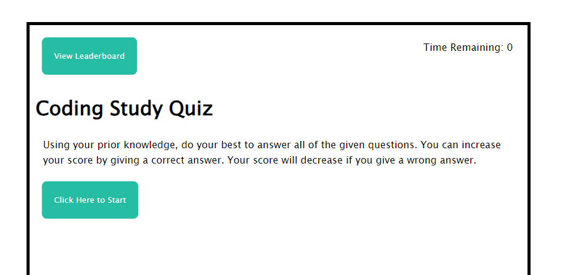
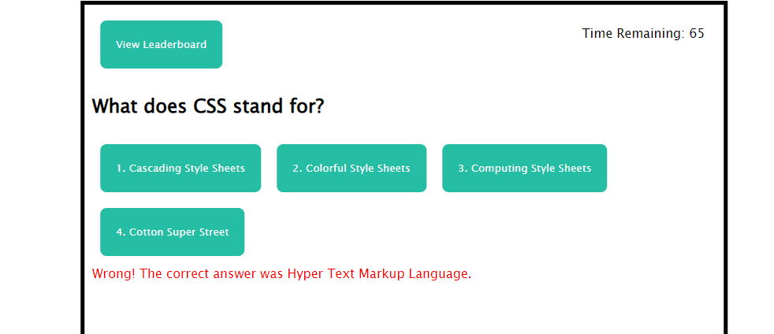
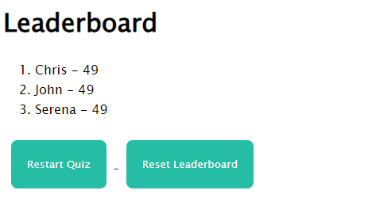

# study-quiz
javascript-html-css-study-quiz
## Description:
Application using HTML, CSS, and JavaScript. Main use for the application is to learn more about coding by taking this study quiz. There is main menu screen where you can start the quiz or view the leaderboard. After the quiz starts, you will be given a series of questions to test your coding knowledge. If you answer a question wrong, it will deduct score. If the timer runs out, it is Game Over! Don't forget to save your score to the leaderboard after you're done! Good luck!
## Instructions:
To start the quiz, click the "Click Here to Start" button. Use your prior coding to knowledge to answer each question. To answer a question, click on the highlighted choices. Wrong answers will deduct from your time! View the leaderboard to save your score. Click the "Submit Score to Leaderboard" button to save your score. Click the "Restart Quiz" button to restart the quiz, and your score should be saved even after restarting. Good luck!
## Application URL:

## Screenshots:
Landing Page Screenshot: 

Study Quiz Screenshot: 

Leaderboard Screenshot: 